# Steps for starting a project in Web 101

## Creating A Repo
**Head over to github.com and create a new repo by clicking the *new* green button.**

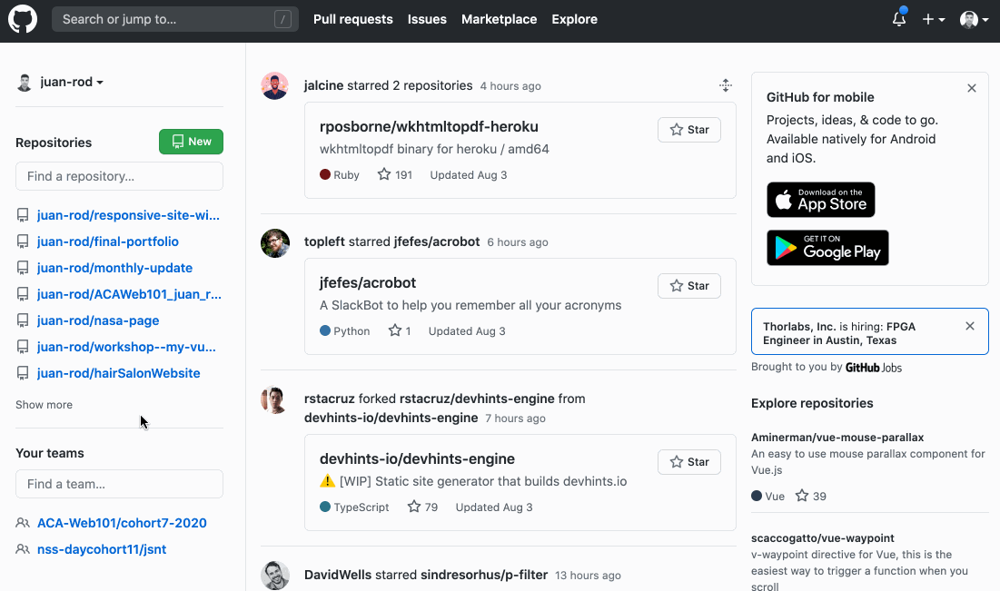

**Host your repo with github pages**

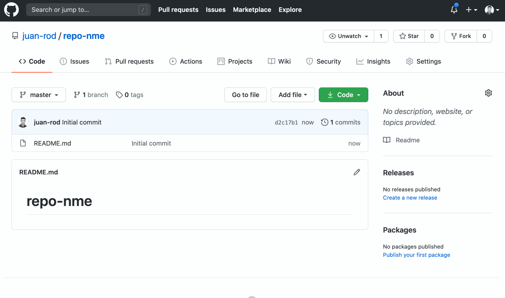

**Assign a reviewer (me: juan-rod)**

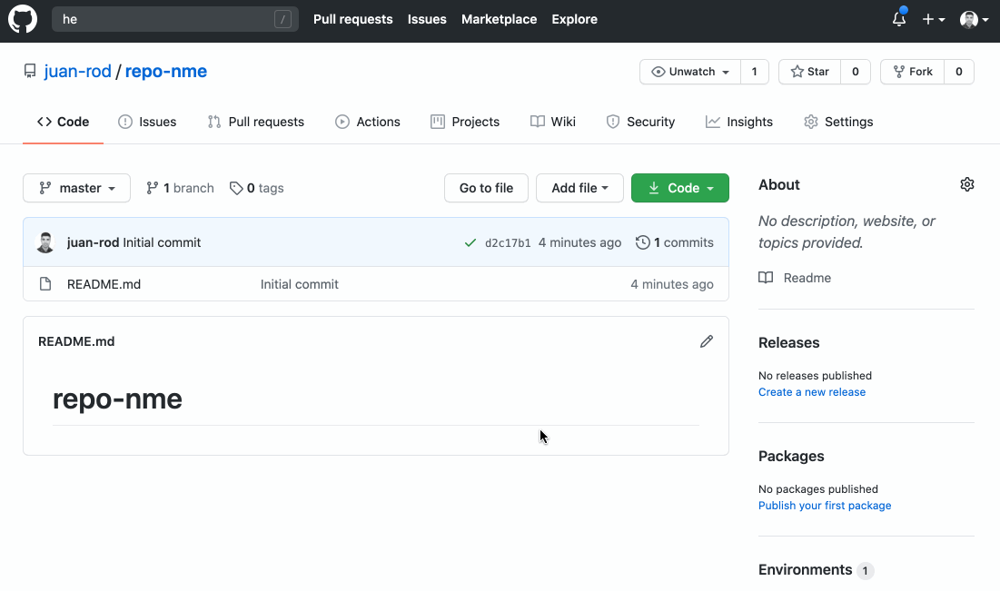

**Clone repo**

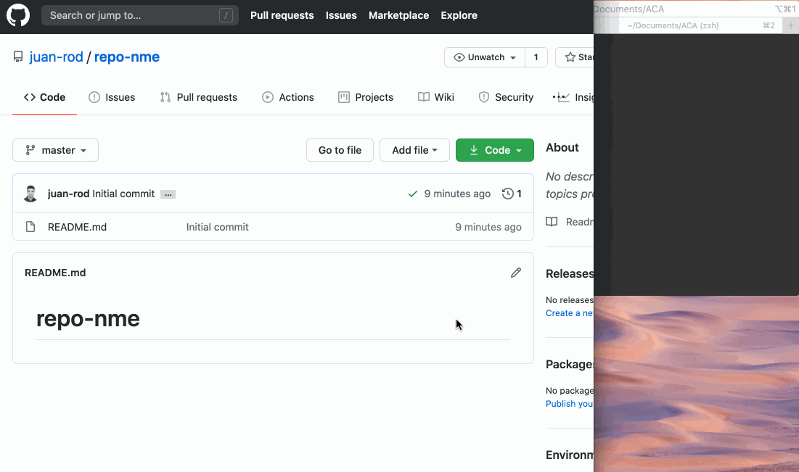

**`cd` into repo folder and create files by using `touch`**

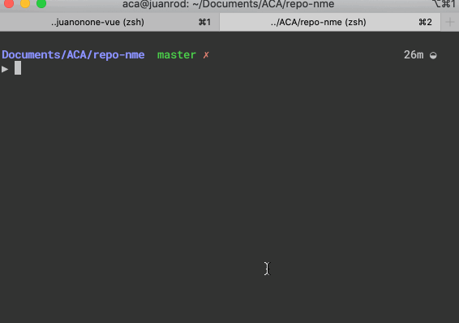

**set up your index template**

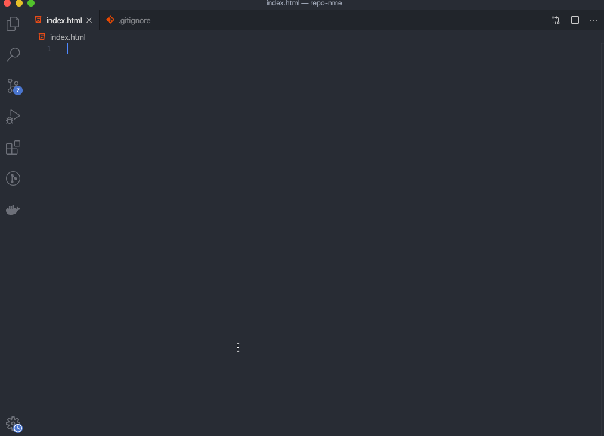

**gitignore**

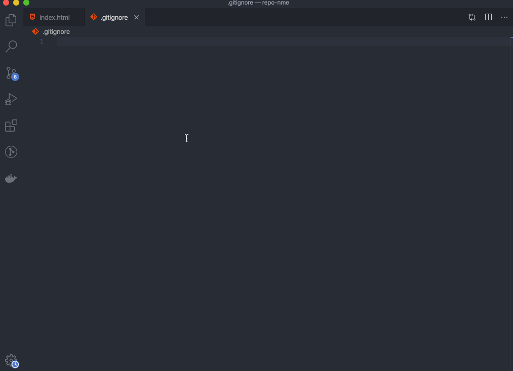

**push up your changes**

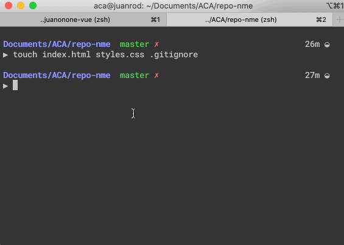

**create a branch**

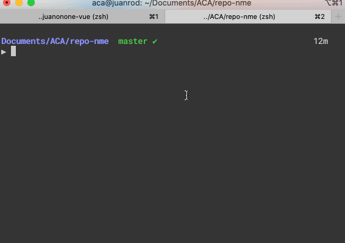

**view a list of your branches**

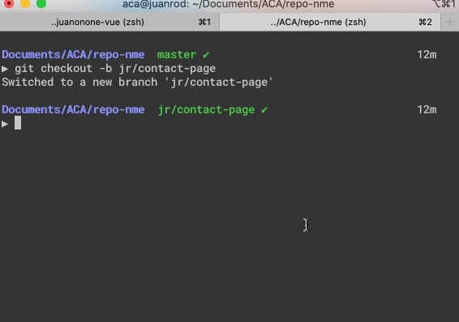

**switch back to master when you want to create a new branch or to work from master**

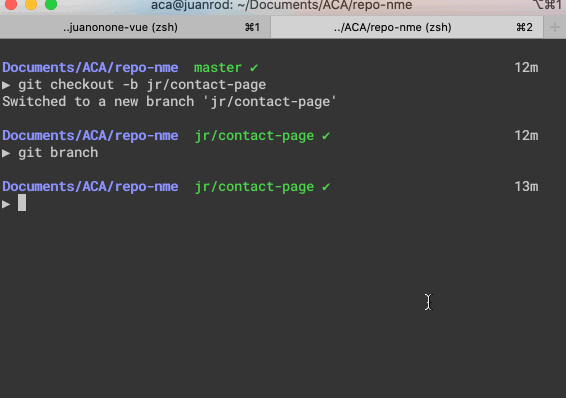

**set up branched pages**

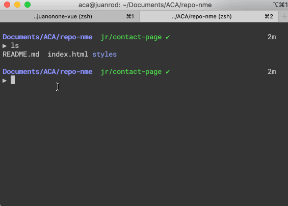

**push up changes**

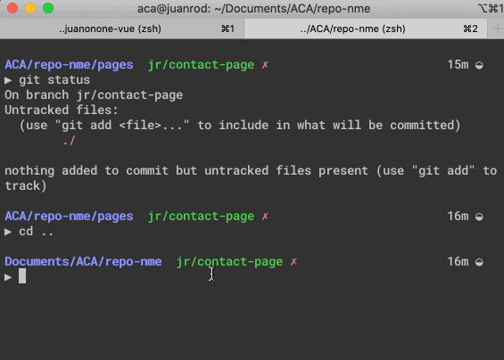

**create a pull request**

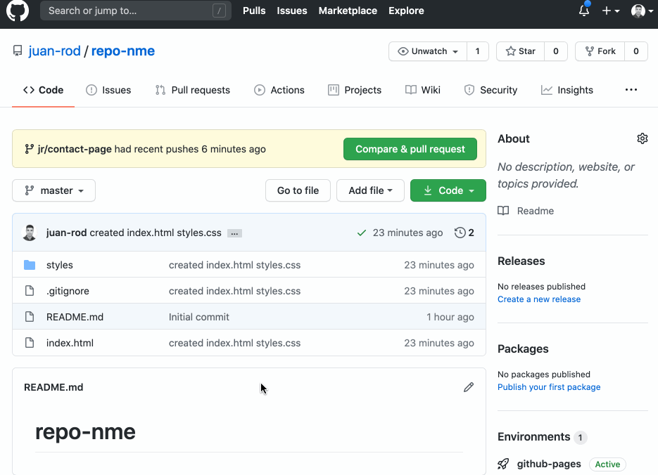
